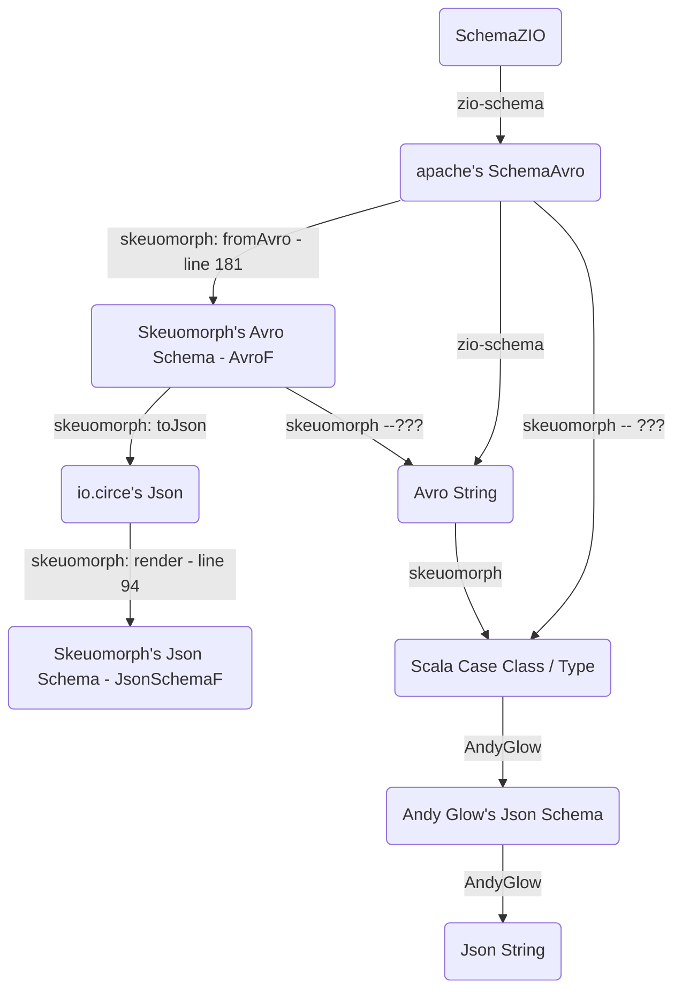

# Roadmap of Tasks

### [1] Compare the different kinds of implementations for each schema language within all libraries

**Reason:** to compare schemas and to compare avro schemas and to compare json schemas across libraries.

**Task component ideas:**

* Schema (string-schema-language-independent ADT scala structures): compare different libraries' implementations of ADTs to build a **schema**:
  * `zio` library: [`Schema[_]`](https://github.com/zio/zio-schema/blob/4e1e00193a59e5d3465fbb76433be5e680df21d7/zio-schema/shared/src/main/scala/zio/schema/Schema.scala#L287-L373)
   
  * Wiem El Abadine library: [`SchemaF`](https://github.com/wi101/recursion-schemes-lc2018/blob/master/src/main/scala/solutions/1-schema.scala#L11-L22).
  
 
* Json: compare different libraries' implementations of ADTs to build a `Json` **schema**:
  * `zio` library:  
    * [`def jsonEncoder`, `def jsonDecoder`, `def jsonCodec`](https://github.com/statisticallyfit/zio-schema/blob/main/zio-schema-json/shared/src/main/scala/zio/schema/codec/JsonCodec.scala#L90-L97)
    * [`def primitiveCodec`](https://github.com/statisticallyfit/zio-schema/blob/main/zio-schema-json/shared/src/main/scala/zio/schema/codec/JsonCodec.scala#L115)
    * `object JsonEncoder`: [`def encode`, `def schemaEncoder`, `def transformEncoder`, `def dynamicEncoder`, `def enumEncoder`, `def recordEncoder`](https://github.com/statisticallyfit/zio-schema/blob/main/zio-schema-json/shared/src/main/scala/zio/schema/codec/JsonCodec.scala#L150-L159)
    * `object JsonDecoder`: [`def decode`, `def schemaDecoder`, __, `def dynamicDecoder`, `def enumDecoder`, `def recordDecoder`](https://github.com/statisticallyfit/zio-schema/blob/main/zio-schema-json/shared/src/main/scala/zio/schema/codec/JsonCodec.scala#L436-L452)
    
  * Andy Glow `scala-jsonschema` library: [`Schema`](https://github.com/andyglow/scala-jsonschema#in-lined)
   
  * `skeuomorph` library: [`JsonSchemaF`](https://github.com/higherkindness/skeuomorph/blob/main/src/main/scala/higherkindness/skeuomorph/openapi/JsonSchema.scala#L27).

* Avro: compare different libraries' implementations of ADTs to build an `Avro` **schema**:
  * `zio` library: `Schema[_]`
  * `org.apache.avro` library: `SchemaAvro`
  * `skeuomorph` library: `AvroF` 
  * [Wiem El Abadine's library: `SchemaF[_]`](https://github.com/wi101/recursion-schemes-lc2018/blob/master/src/main/scala/solutions/2-avro.scala#L92).

   
* Protobuf: compare ...
  * `zio` library: [`ProtobufCodec`](https://github.com/zio/zio-schema/blob/4e1e00193a59e5d3465fbb76433be5e680df21d7/zio-schema-protobuf/shared/src/main/scala/zio/schema/codec/ProtobufCodec.scala) 
  * `skeuomorph` library: [`ProtobufF`](https://github.com/higherkindness/skeuomorph/blob/main/src/main/scala/higherkindness/skeuomorph/protobuf/schema.scala#L61-L93) 
  * 47degrees blog: [`ProtobufF`](https://github.com/statisticallyfit/ScalaCategoryTheory/blob/master/src/main/scala/RecursionSchemeTutorials/FortySevenDegrees/ProtobufDrosteExample/proto/ProtobufF.scala) 
  

**LIST OF LIBRARIES USED**:
- `zio-schema`
- `skeuomorph`
- Andy Glow's `scala-jsonschema`
- [Wiem el Abadine's matryoshka/schema/avro implementations](https://github.com/wi101/recursion-schemes-lc2018/blob/master/src/main/scala/solutions/2-avro.scala#L92)
- [blog 47degrees' `ProtobufF`](https://github.com/statisticallyfit/ScalaCategoryTheory/blob/master/src/main/scala/RecursionSchemeTutorials/FortySevenDegrees/ProtobufDrosteExample/proto/ProtobufF.scala)

### [2] Do round trip conversions

**Reasons:**
* to create seamless conversion between schemas, wherever they come from.
* to create seamless conversion between strings, wherever they come from.

**Task component ideas:**
* 

**LOG OF CONVERSIONS FOUND:**
* Schema ADT:
* Avro:
  * `zio` <--> `org.apache.avro`
    * [zio's `Schema[_]` --> org.apache.avro's `SchemaAvro`](https://github.com/zio/zio-schema/blob/4e1e00193a59e5d3465fbb76433be5e680df21d7/zio-schema-avro/shared/src/main/scala/zio/schema/codec/AvroCodec.scala#L33-L34) (function `def encodeToApacheAvro`)
    * [org.apache.avro's `SchemaAvro` to zio's `Schema[_]`](https://github.com/zio/zio-schema/blob/4e1e00193a59e5d3465fbb76433be5e680df21d7/zio-schema-avro/shared/src/main/scala/zio/schema/codec/AvroCodec.scala#L49-L212) (function `def toZioSchema`)
  * [Wiem El Abadine's `SchemaF`](https://github.com/wi101/recursion-schemes-lc2018/blob/master/src/main/scala/solutions/1-schema.scala#L11-L22) <--> zio's `Schema` <--> Skeuomorph's `AvroF`
  * 
* Json:
  * `zio` <--> `Json` string
    * `zio`'s `JsonEncoder` and `JsonDecoder` conversion back and forth to `Json` string: [`def fromJson, def toJson`](https://zio.dev/guides/tutorials/encode-and-decode-json-data/)
    * [`def fromJson`, `def toJson`](https://github.com/zio/zio-json/blob/c036622e17f50da663c010b13d4f3e5b65dbfb10/zio-json/shared/src/main/scala/zio/json/package.scala#L22-L43)
    * [`JsonType`](https://github.com/zio/zio-json/blob/series/2.x/zio-json/shared/src/main/scala/zio/json/ast/JsonType.scala#L40)
    * [`Json` ast](https://github.com/zio/zio-json/blob/series/2.x/zio-json/shared/src/main/scala/zio/json/ast/ast.scala)
* Protobuf:
* 
* zio's / apache's SchemaAvro --> Avro String (zio)
* Avro String --> scala case class (skeuomorph)
* zio's / apache's SchemaAvro --> skeuomorph's Schema Avro (AvroF) (skeuomorph)
* scala case class --> json string (andy glow)
* scala case class --> avro string (zio)
* avro string <--> json string (skeuomorph??)
* [`skeuomorph` `Avro` schema --> `io.circe.Json` string](https://github.com/higherkindness/skeuomorph/blob/main/src/main/scala/higherkindness/skeuomorph/avro/schema.scala#L238-L303)
* [json schema (skeuomorph)](https://github.com/higherkindness/skeuomorph/blob/main/src/main/scala/higherkindness/skeuomorph/openapi/JsonSchema.scala#L94) <--> json string

NOTE:
- S = schema
- K = skeuomorph
- A = avro string
- Z = zio
- C = scala case class
- J = json string
- I = circe
- G = Andy Glow

Representations:
- **Json string**
    - output of: Andy Glow's `scala-jsonschema` library
    - output of: `skeuomorph` library
- **Json schema (ADT)**
    - Andy Glow's library `scala-jsonschema`
    - `io.circe` library's `Json`
    - `skeuomorph` library's `JsonSchemaF`
- **Avro string**
    - output of: `zio-schema` library
    - output of: `skeuomorph` library
- **Avro schema (ADT)**
    - `zio-schema` library's `Schema` (TODO check)
    - `org.apache.avro` library's `Schema`
    - `skeuomorph` library's `AvroF`

### [3] Compare keywords between Avro and Json schemas

**Reason:** to understand better how to convert/morph between  `Avro` and `Json` schemas.

**Description:** Analyze the syntax of both `Avro` and `Json` schemas and compare / contrast them. Must categorize differences in syntax and bridge them.

**Task component ideas:**
* `#task` compare json schemas using **Draft06** and **Draft04** etc (source: Andy Glow's `scala-jsonschema` library).
* `#task` make a log of all the syntax differences in `Avro` (canonically formatted) string (from `zio-schema`) versus in `Json` string (from `scala-jsonschema`) (e.g. `name`, `type`, `record`... etc)
Put `hyp.is` link to `Json` schema keywords (defined in an online tutorial of how to write `Json` schema), in the empty code test of the difference between `Json`/`Avro` schema keywords.
* `#task` `middleName` field in `Person` class from Andy Glow library when printed as `Json` string, has type `String` whereas the equivalent `Avro` string has type `null`-or-`string` because its scala type is `Option[String]`.

### [4] Create tests documenting how schema-ADTs become schema-strings

**Description:** create tests describing how libraries convert avro/json/protobuf schema-ADTs into avro/json/protobuf strings

**Reason:** to have a catalog of tests that show how each ADT gets matched to string representation.

**Task component ideas:**
* do tests for `enum` type
* do tests for `case class` type
* do tests for primitive types (e.g. `String`, `Option[_]`, `Integer`... etc)

**Sources of inspiration for tests:**
* [zio's AvroCodecSpec.scala](https://github.com/zio/zio-schema/blob/4e1e00193a59e5d3465fbb76433be5e680df21d7/zio-schema-avro/shared/src/test/scala-2/zio/schema/codec/AvroCodecSpec.scala)
* [zio's DeriveSchemaSpec.scala](https://github.com/zio/zio-schema/blob/4e1e00193a59e5d3465fbb76433be5e680df21d7/zio-schema-derivation/shared/src/test/scala/zio/schema/DeriveSchemaSpec.scala)

#### [TASK: 4a] Create tests documenting conversion of `Avro` schema-ADT into `Avro` string.

* [`zio`: `Schema[_]` --> `Avro` string](https://github.com/zio/zio-schema/blob/4e1e00193a59e5d3465fbb76433be5e680df21d7/zio-schema-avro/shared/src/main/scala/zio/schema/codec/AvroCodec.scala#L30-L31)
* 

#### [TASK: 4b] Create tests documenting conversion of `Json` schema-ADT into `Json` string. 

* [`skeuomorph`: `JsonSchemaF` --> `Json` string](https://github.com/higherkindness/skeuomorph/blob/main/src/main/scala/higherkindness/skeuomorph/openapi/JsonSchema.scala#L94-L127)
* [Andy Glow's `scala-jsonschema`: `Schema` -->  `Json` string](https://github.com/andyglow/scala-jsonschema#in-lined)

#### [TASK: 4c] Create tests documenting conversion of `Protobuf` schema-ADT into `Protobuf` string.

### [5] Add `Specs2` framework to do the testing

### [6] Study `skeuomorph` library in depth:
**Reasons:**
1. has better / more clearly structured / simpler ADTs
2. has conversion between `Avro` (string? schema?) to `Json` (string? schema?) [(source)](https://github.com/higherkindness/skeuomorph/blob/main/src/main/scala/higherkindness/skeuomorph/avro/Protocol.scala#L45)
3.

**Task component ideas:**
* study the function [`fromAvro`](https://github.com/higherkindness/skeuomorph/blob/main/src/main/scala/higherkindness/skeuomorph/avro/schema.scala#L181) (reason: to see how conversion happens between `skeuomorph`'s `Avro` schema and the apache `Avro` schema. )
* study the `skeuomorph` `Avro` [ADTs](https://github.com/higherkindness/skeuomorph/blob/main/src/main/scala/higherkindness/skeuomorph/avro/schema.scala#L196)
* study the function [`toJson`](https://github.com/higherkindness/skeuomorph/blob/main/src/main/scala/higherkindness/skeuomorph/avro/Protocol.scala#LL44C1-L44C1) (reason: to see how conversion happens between `Avro` (string?) to `Json` (string?))

