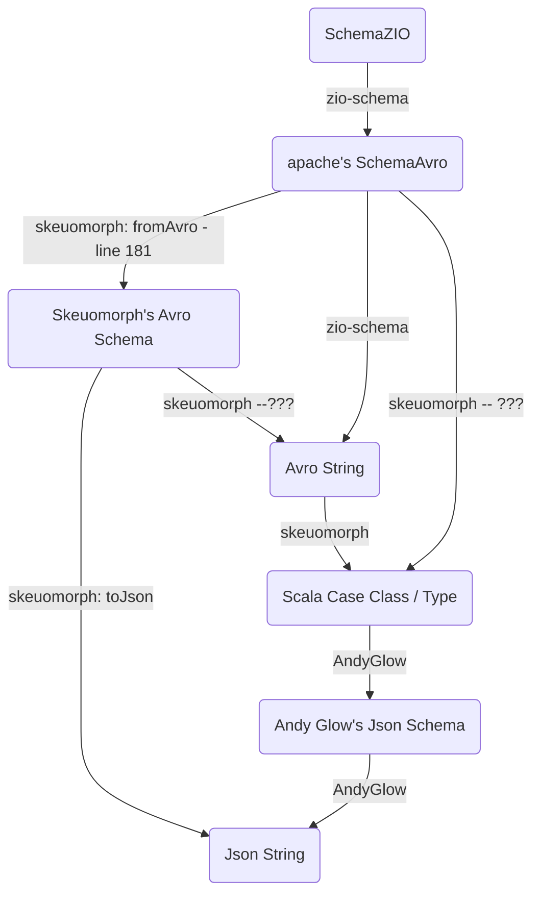

# Roadmap of Tasks

### [1] Compare keywords between Avro and Json schemas
**Reason:** to understand better how to convert between  `Avro` and `Json` schemas.
**Description:** Analyze the keywords of both `Avro` and `Json` schemas and compare / contrast them. Must categorize differences in syntax and neutralize them when converting between the schemas.
**Task component ideas:**
* (meta-task) compare between json schemas using **Draft06** and **Draft04** etc (source: Andy Glow's `scala-jsonschema` library).
* (meta-task) make a log of all the keywords in `Avro` string (from `zio-schema`) versus in `Json` string (from Andy Glow's `scala-jsonschema`) (e.g. `name`, `type`, `record`... etc)
* (meta-task) put `hyp.is` link to `Json` schema keywords (defined in an online tutorial of how to write `Json` schema), in the empty code test of the difference between `Json`/`Avro` schema keywords.
* (example-task) `middleName` field in `Person` class from Andy Glow library when printed as `Json` string, has type `String` whereas the equivalent `Avro` string has type `null`-or-`string` because its scala type is `Option[String]`.

### [2] Create tests documenting how Andy Glow's `scala-jsonschema` creates schemas for scala types.
**Description:** create tests describing how Andy Glow's library converts scala type into `Json` schemas, using `zio`'s [`AvroCodecSpec`](https://github.com/zio/zio-schema/blob/4e1e00193a59e5d3465fbb76433be5e680df21d7/zio-schema-avro/shared/src/test/scala-2/zio/schema/codec/AvroCodecSpec.scala) and [`DeriveSchemaSpec`](https://github.com/zio/zio-schema/blob/4e1e00193a59e5d3465fbb76433be5e680df21d7/zio-schema-derivation/shared/src/test/scala/zio/schema/DeriveSchemaSpec.scala) as template / inspiration.
**Reason:** to have a catalog of tests that show how each scala type gets converted differently in `Json` versus `Avro`.
**Task component ideas:**
* do tests for `enum` type
* do tests for `case class` type
* do tests for primitive types (e.g. `String`, `Option[_]`, `Integer`... etc)

### [3] Add `Specs2` framework to do the testing

### [4] Compare the different kinds of schemas within all three libraries

**Task component ideas:**
* compare `zio` **schema** with `skeuomorph` **schema** (with Andy Glow's `scala-json` **schema**?).
* compare `zio`'s `Avro` **schema** with `skeuomorph`'s `Avro` **schema**.
* compare Andy Glow's `scala-jsonschema`'s `Json` **schema** with `skeuomorph`'s `Json` **schema**.

**Reason:** to compare schemas and to compare avro schemas and to compare json schemas across libraries.

### [5] Study `skeuomorph` library in depth:
**Reasons:**
1. has better / more clearly structured / simpler ADTs
2. has conversion between `Avro` (string? schema?) to `Json` (string? schema?) [(source)](https://github.com/higherkindness/skeuomorph/blob/main/src/main/scala/higherkindness/skeuomorph/avro/Protocol.scala#L45)
3.

**Task component ideas:**
* study the function [`fromAvro`](https://github.com/higherkindness/skeuomorph/blob/main/src/main/scala/higherkindness/skeuomorph/avro/schema.scala#L181) (reason: to see how conversion happens between `skeuomorph`'s `Avro` schema and the apache `Avro` schema. )
* study the `skeuomorph` `Avro` [ADTs](https://github.com/higherkindness/skeuomorph/blob/main/src/main/scala/higherkindness/skeuomorph/avro/schema.scala#L196)
* study the function [`toJson`](https://github.com/higherkindness/skeuomorph/blob/main/src/main/scala/higherkindness/skeuomorph/avro/Protocol.scala#LL44C1-L44C1) (reason: to see how conversion happens between `Avro` (string?) to `Json` (string?))

### [6] Do round trip conversions
**Reasons:**
* to create seamless conversion between schemas, wherever they come from.
* to create seamless conversion between strings, wherever they come from.

**Task component ideas:**
* zio's / apache's SchemaAvro --> Avro String (zio)
* Avro String --> scala case class (skeuomorph)
* zio's / apache's SchemaAvro --> skeuomorph's Schema Avro (AvroF) (skeuomorph)
* scala case class --> json string (andy glow)
* scala case class --> avro string (zio)
* avro string <--> json string (skeuomorph??)

