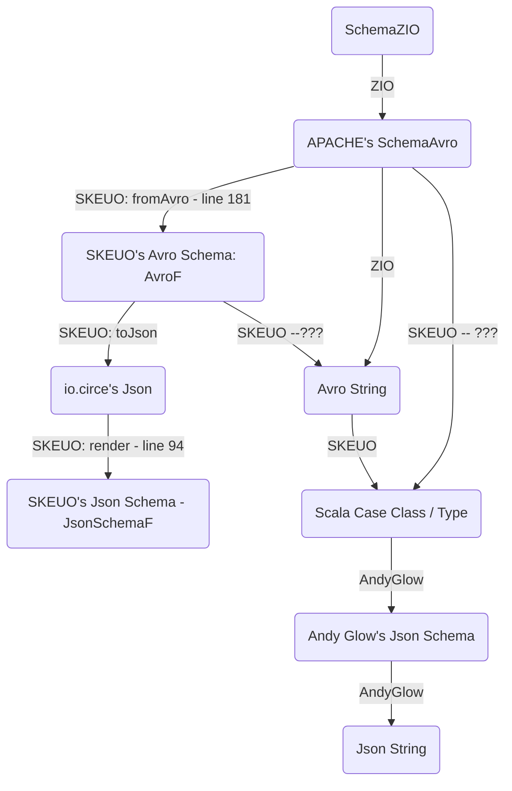

# Roadmap of Tasks

### [1] Compare the different kinds of implementations for each schema language within all libraries

**Reason:** to compare schemas and to compare avro schemas and to compare json schemas across libraries.

**Task component ideas:**

* **Schema (string-schema-language-independent ADT scala structures)**: compare different libraries' implementations of ADTs for **schema**:
  * ZIO library: 
    * [`ZioSchema[_]` trait](https://github.com/zio/zio-schema/blob/4e1e00193a59e5d3465fbb76433be5e680df21d7/zio-schema/shared/src/main/scala/zio/schema/Schema.scala#L375-L454) (has `Field`, `Record`, `Fixed`, etc)
    * `ZioSchema[_]` construction examples (`CaseClass2`, `Enum`, etc) in [DeriveSchemaSpec.scala](https://github.com/zio/zio-schema/blob/4e1e00193a59e5d3465fbb76433be5e680df21d7/zio-schema-derivation/shared/src/test/scala/zio/schema/DeriveSchemaSpec.scala#L300)
   
  * WIEMAB library: [`SchemaF[_]`](https://github.com/wi101/recursion-schemes-lc2018/blob/master/src/main/scala/solutions/1-schema.scala#L11-L22)
  
  * 47DEG library: [`SchemaF[_]`](https://github.com/statisticallyfit/ScalaCategoryTheory/blob/master/src/main/scala/RecursionSchemeTutorials/FortySevenDegrees/ProtobufDrosteExample/SchemaF.scala#L9-L23) 

    
* **Avro**: compare different libraries' implementations of ADTs for `Avro` **schema**:
    * :x: ZIO library
    * APACHE library: `SchemaApacheAvro`
    * SKEUO library: `AvroF[_]`
    * :x: WIEMAB's library
        * NOTE: found that only APACHE and SKEUO contain schema-ADTs for the `Avro` language - the rest have just generic **schema**s.

* **Json**: compare different libraries' implementations of ADTs for `Json` **schema**:
  * ZIO library:  
    * type-level conversions: 
      * ???
    * value-level conversions:
      * [`def jsonEncoder`, `def jsonDecoder`, `def jsonCodec`](https://github.com/statisticallyfit/zio-schema/blob/main/zio-schema-json/shared/src/main/scala/zio/schema/codec/JsonCodec.scala#L90-L97)
      * [`def primitiveCodec`](https://github.com/statisticallyfit/zio-schema/blob/main/zio-schema-json/shared/src/main/scala/zio/schema/codec/JsonCodec.scala#L115)
      * `object JsonEncoder`: [`def encode`, `def schemaEncoder`, `def transformEncoder`, `def dynamicEncoder`, `def enumEncoder`, `def recordEncoder`](https://github.com/statisticallyfit/zio-schema/blob/main/zio-schema-json/shared/src/main/scala/zio/schema/codec/JsonCodec.scala#L150-L159)
      * `object JsonDecoder`: [`def decode`, `def schemaDecoder`, __, `def dynamicDecoder`, `def enumDecoder`, `def recordDecoder`](https://github.com/statisticallyfit/zio-schema/blob/main/zio-schema-json/shared/src/main/scala/zio/schema/codec/JsonCodec.scala#L436-L452)
    
  * ANDY GLOW library: [`json.Schema`](https://github.com/andyglow/scala-jsonschema#in-lined)
   
  * SKEUO library: [`JsonSchemaF`](https://github.com/higherkindness/skeuomorph/blob/main/src/main/scala/higherkindness/skeuomorph/openapi/JsonSchema.scala#L27)

   
* **Protobuf**: compare different libraries' implementations of ADTs for `Protobuf` **schema**:
  * ZIO library: [`ProtobufCodec`](https://github.com/zio/zio-schema/blob/4e1e00193a59e5d3465fbb76433be5e680df21d7/zio-schema-protobuf/shared/src/main/scala/zio/schema/codec/ProtobufCodec.scala) 
  * SKEUO library: [`ProtobufF`](https://github.com/higherkindness/skeuomorph/blob/main/src/main/scala/higherkindness/skeuomorph/protobuf/schema.scala#L61-L93) 
  * 47DEG: [`ProtobufF`](https://github.com/statisticallyfit/ScalaCategoryTheory/blob/master/src/main/scala/RecursionSchemeTutorials/FortySevenDegrees/ProtobufDrosteExample/proto/ProtobufF.scala) 
  

**LIST OF LIBRARIES USED**:
- `zio-schema` (ZIO)
- `org.apache.avro` (APACHE)
- `skeuomorph` (SKEUO)
- Andy Glow's `scala-jsonschema` (ANDY GLOW)
- Wiem El Abadine's matryoshka/schema/avro implementations (WIEMAB)
- blog 47degrees' `ProtobufF` library (47DEG)

### [2] Do round trip conversions between schemas and strings (within / between libraries)

**Reasons:**
* to create seamless conversion between schemas, wherever they come from.
* to create seamless conversion between strings, wherever they come from.

**Task component ideas (brief):**
- schema <--> schema
  - adt <--> adt
- avro <--> avro
  - adt <--> adt
  - adt <--> string
- json <--> json
  - adt <--> adt
  - adt <--> string
- avro <--> json
  - adt <--> adt
  - adt <--> string 
- protobuf <--> protobuf
  - ...
- protobuf <--> avro
  - ...
- protobuf <--> json
  - ...

**Task component ideas (long, with links):**

note: use [`hasSameSchemaStructure`](https://github.com/zio/zio-schema/blob/4e1e00193a59e5d3465fbb76433be5e680df21d7/zio-schema/shared/src/test/scala/zio/schema/SchemaAssertions.scala) for comparing schemas

* **Schema (string-schema-language-independent ADT scala structures)**: 
 
  * <u>ZIO <--> WIEMAB</u>
    * :x: WIEMAB's [`SchemaF[_]`](https://github.com/wi101/recursion-schemes-lc2018/blob/master/src/main/scala/solutions/1-schema.scala#L11-L22) --> ZIO's [`ZioSchema[_]`](https://github.com/zio/zio-schema/blob/4e1e00193a59e5d3465fbb76433be5e680df21d7/zio-schema/shared/src/main/scala/zio/schema/Schema.scala#L375-L454)
    * :x: ZIO's [`ZioSchema[_]`](https://github.com/zio/zio-schema/blob/4e1e00193a59e5d3465fbb76433be5e680df21d7/zio-schema/shared/src/main/scala/zio/schema/Schema.scala#L375-L454) --> WIEMAB's [`SchemaF[_]`](https://github.com/wi101/recursion-schemes-lc2018/blob/master/src/main/scala/solutions/1-schema.scala#L11-L22)
     
  * :x: <u>ZIO <--> 47DEG</u>
   
  * :x: <u>WIEMAB <--> 47DEG </u>

* **Avro**:
   
  * **ADT conversions:**
    * <u>ZIO <--> APACHE</u>
      * :large_blue_circle: ZIO's `ZioSchema[_]` --> APACHE's `SchemaApacheAvro`: [(function `def encodeToApacheAvro`)](https://github.com/zio/zio-schema/blob/4e1e00193a59e5d3465fbb76433be5e680df21d7/zio-schema-avro/shared/src/main/scala/zio/schema/codec/AvroCodec.scala#L33-L34)
      * :large_blue_circle:  APACHE's `SchemaApacheAvro` --> ZIO's `ZioSchema[_]`: [(function `def toZioSchema`)](https://github.com/zio/zio-schema/blob/4e1e00193a59e5d3465fbb76433be5e680df21d7/zio-schema-avro/shared/src/main/scala/zio/schema/codec/AvroCodec.scala#L49-L212)
       
    * <u>ZIO <--> SKEUO</u> 
      * :x: ZIO's `ZioSchema[_]` -->  SKEUOs `AvroF[_]`: _____________________
      * :x: SKEUO's `AvroF[_]` --> ZIO's `ZioSchema[_]`: _____________________
    
    * <u>SKEUO <--> APACHE </u> 
      * :large_blue_circle: APACHE's `SchemaApacheAvro` --> SKEUO's `AvroF[_]`: [(function `def fromAvro: Coalgebra[AvroF[_], SchemaAvro]`)](https://github.com/higherkindness/skeuomorph/blob/main/src/main/scala/higherkindness/skeuomorph/avro/schema.scala#L178-L187)
      * :large_blue_circle: SKEUO's `AvroF[_]` --> APACHE's `SchemaApacheAvro`: ________ 
        * closest find is [function `def checkSchema: Algebra[AvroF[_], Boolean]` and function `def convertSchema`](https://github.com/higherkindness/skeuomorph/blob/main/src/test/scala/higherkindness/skeuomorph/avro/AvroSchemaSpec.scala#L35-L42)
         
    * <u>WIEMAB <--> APACHE</u>
      * WIEMAB's `SchemaF[_]` --> APACHE's `SchemaApacheAvro`
  
        * :large_blue_circle: [using `def labelledToSchema: Algebra[Labelled, SchemaAvro]` (has type `Labelled[SchemaAvro] => SchemaAvro`)](https://github.com/wi101/recursion-schemes-lc2018/blob/master/src/main/scala/solutions/2-avro.scala#L92-L111)
        * :large_blue_circle: [using `def schemaFToAvro[T](schemaF: T)(implicit T: Recursive.Aux[T, SchemaF]): SchemaAvro`](https://github.com/wi101/recursion-schemes-lc2018/blob/master/src/main/scala/solutions/2-avro.scala#L118-L119)
        * :large_blue_circle: [using registry `def toAvro[T](schemaF: T)(implicit T: Recursive.Aux[T, SchemaF]): SchemaAvro`](https://github.com/wi101/recursion-schemes-lc2018/blob/master/src/main/scala/solutions/2-avro.scala#L182-L183)
       
      * :large_blue_circle: APACHE's `SchemaApacheAvro` --> WIEMAB's `SchemaF[_]`: ([function `def avroToSchemaF: CoalgebraM[Option, SchemaF, SchemaAvro]`](https://github.com/wi101/recursion-schemes-lc2018/blob/master/src/main/scala/solutions/2-avro.scala#L188-L206))
       
    * :x: <u>WIEMAB <--> SKEUO</u>
        * WIEMAB's `SchemaF[_]` --> SKEUO's `AvroF[_]`
        * SKEUO's `SchemaF[_]` --> WIEMAB's `SchemaF[_]`
        * **TODO** compare WIEMAB's [`LabelledPath`](https://github.com/wi101/recursion-schemes-lc2018/blob/master/src/main/scala/solutions/2-avro.scala#L92) with SKEUO's [`Path`](https://github.com/higherkindness/skeuomorph/blob/main/src/main/scala/higherkindness/skeuomorph/openapi/schema.scala#L295)
       

  * **String conversions:**
    * <u>`Avro` schema ADT <--> `Avro` string </u>:
      * ZIO:
        * ZIO's `ZioSchema` --> `Avro` string: 
          * :large_blue_circle: see tests for [`Enum`, `UnionWithNesting`](https://github.com/zio/zio-schema/blob/4e1e00193a59e5d3465fbb76433be5e680df21d7/zio-schema-avro/shared/src/test/scala-2/zio/schema/codec/AvroCodecSpec.scala#L109-L140), and `CaseObjects..Adt` etc. in [`AvroCodecSpec.scala`](https://github.com/zio/zio-schema/blob/4e1e00193a59e5d3465fbb76433be5e680df21d7/zio-schema-avro/shared/src/test/scala-2/zio/schema/codec/AvroCodecSpec.scala)
      * APACHE: 
      * SKEUO:
        * SKEUO's `AvroF` <--> `Avro` string: 
      * :x: WIEMAB:
       
    * <u>Scala case class / types --> `Avro` string</u>: 

      * ZIO: 
        * :large_blue_circle: [(function `def encode`)](https://github.com/zio/zio-schema/blob/4e1e00193a59e5d3465fbb76433be5e680df21d7/zio-schema-avro/shared/src/main/scala/zio/schema/codec/AvroCodec.scala#L30-L31)
        * :large_blue_circle: [see tests in `AvroCodecSpec.scala`](https://github.com/zio/zio-schema/blob/4e1e00193a59e5d3465fbb76433be5e680df21d7/zio-schema-avro/shared/src/test/scala-2/zio/schema/codec/AvroCodecSpec.scala#L61-L89)

      * :large_blue_circle: (SKEUO)  _______ 
       
      * :large_blue_circle: (WIEMAB)  ______
 
    * <u>`Avro` string --> Scala case class / types</u>:
      * :x: ~~ZIO~~
       
      * :large_blue_circle: (SKEUO)  [`scheme.hylo`, `fromAvro`, `printSchemaAsScala` example](https://hyp.is/928atAU0Ee6NDuOwQg_iUA/higherkindness.github.io/skeuomorph/docs/)
       
      * :x: ~~WIEMAB~~
     
    
     
* **Json**:
   
  * **ADT conversions:**
  * 
    * :x: SKEUO's <--> ZIO
      * :x: compare: SKEUO's `JsonEncoder`[file](https://github.com/higherkindness/skeuomorph/blob/main/src/main/scala/higherkindness/skeuomorph/openapi/JsonEncoders.scala) | [tests-NOLINK](https://github.com/higherkindness/skeuomorph/tree/main/src/test/scala/higherkindness/skeuomorph/openapi) with ZIO's `JsonEncoder`[file](https://github.com/zio/zio-json/tree/series/2.x/zio-json/shared/src/main/scala/zio/json) | [tests](https://github.com/zio/zio-json/blob/series/2.x/zio-json/shared/src/test/scala/zio/json/EncoderSpec.scala)
      * :x: compare: SKEUO's `JsonDecoder` [file](https://github.com/higherkindness/skeuomorph/blob/main/src/main/scala/higherkindness/skeuomorph/openapi/JsonDecoders.scala) | [tests](https://github.com/higherkindness/skeuomorph/blob/main/src/test/scala/higherkindness/skeuomorph/openapi/JsonSchemaDecoderSpecification.scala) with ZIO's `JsonDecoder` [file](https://github.com/zio/zio-json/blob/series/2.x/zio-json/shared/src/main/scala/zio/json/JsonDecoder.scala) | [tests](https://github.com/zio/zio-json/blob/series/2.x/zio-json/shared/src/test/scala/zio/json/DecoderSpec.scala)
      * SKEUO's `JsonSchemaF` <--> ZIO's `Json` schema ADTs (functions [`def jsonEncoder`, `def jsonDecoder`, `def jsonCodec`)](https://github.com/statisticallyfit/zio-schema/blob/main/zio-schema-json/shared/src/main/scala/zio/schema/codec/JsonCodec.scala#L90-L97)
       
    * SKEUO <--> ANDY GLOW
      * :x: SKEUO's `JsonSchemaF` --> ANDY GLOW's `json.Schema`
      * :x: ANDY GLOW's `json.Schema` --> SKEUO's `JsonSchemaF`
 
   

  * **String conversions:**
     
    * <u>`Json` schema ADT <--> `io.circe.Json` object (string?)</u>
      * SKEUO: 
         
        * :large_blue_circle: SKEUO's `JsonSchemaF` --> `io.circe.Json`: [`def render: Algebra[JsonSchemaF, Json]`](https://github.com/higherkindness/skeuomorph/blob/main/src/main/scala/higherkindness/skeuomorph/openapi/JsonSchema.scala#L94)
       
        * :question: `io.circe.Json` --> SKEUO's `JsonSchemaF` [roundtrip codec using circe](https://github.com/higherkindness/skeuomorph/blob/ae486ecec9392ac0d7a56942a43e24990db1de25/src/test/scala/higherkindness/skeuomorph/openapi/OpenApiSchemaSpec.scala#L56) from `OpenApiSchemaSpec.scala`
       
    * <u>`Json` schema ADT <--> `Json` string</u>
       
      * SKEUO:    
         
        * (simple types) SKEUO's `JsonSchemaF` <--> `Json` string 
          * :large_blue_circle: SKEUO's `JsonSchemaF` --> `Json` string: [json fixed tests examples](https://github.com/higherkindness/skeuomorph/blob/main/src/test/scala/higherkindness/skeuomorph/openapi/JsonSchemaPrintSpecification.scala#L21-L35) from `JsonSchemaPrintSpecification.scala`
          * :large_blue_circle: `Json` string --> SKEUO's `JsonSchemaF` [json fixed tests examples](https://github.com/higherkindness/skeuomorph/blob/main/src/test/scala/higherkindness/skeuomorph/openapi/JsonSchemaDecoderSpecification.scala) from `JsonSchemaDecoderSpecification.scala`
           
        * (entire types) SKEUO's `JsonSchemaF` <--> `Json` string 
          * :question: SKEUO's `JsonSchemaF` --> `Json` string
          * :large_blue_circle: `Json` string --> SKEUO's `JsonSchemaF`: [using `io.circe.Json`'s `Decoder[A].decodeJson()`](https://github.com/higherkindness/skeuomorph/blob/main/src/test/scala/higherkindness/skeuomorph/openapi/OpenApiDecoderSpecification.scala#L53-L79) from `OpenApiDecoderSpecification.scala`
      
       
      * ZIO:    
        * TODO left off here look at jsoncodecspec = https://github.com/zio/zio-schema/blob/4e1e00193a59e5d3465fbb76433be5e680df21d7/zio-schema-json/shared/src/test/scala-2/zio/schema/codec/JsonCodecSpec.scala
        * :x: <u>ZIO's json schema or encoder/decoder <--> `Json` string </u>
          * [**tutorial guide** of `JsonEncoder` / `JsonDecoder` conversion <-->> `Json` string: using functions `def fromJson, def toJson`](https://zio.dev/guides/tutorials/encode-and-decode-json-data/)
          * [`def fromJson`, `def toJson`](https://github.com/zio/zio-json/blob/c036622e17f50da663c010b13d4f3e5b65dbfb10/zio-json/shared/src/main/scala/zio/json/package.scala#L22-L43)
          * [`JsonType`](https://github.com/zio/zio-json/blob/series/2.x/zio-json/shared/src/main/scala/zio/json/ast/JsonType.scala#L40)
          * [`Json` ast](https://github.com/zio/zio-json/blob/series/2.x/zio-json/shared/src/main/scala/zio/json/ast/ast.scala)
        
    * <u>Scala case class / types <--> `Json` string (value-level)</u>
         
      * Scala case class / types --> `Json` string
         
        * ZIO: 
          * :large_blue_circle: [using `def toJson`, and `def toJsonAST` in `EncoderSpec.scala`](https://github.com/zio/zio-json/blob/series/2.x/zio-json/shared/src/test/scala/zio/json/EncoderSpec.scala)
         
        * ANDY GLOW library:
          * :large_blue_circle: [`json.Schema[_]` --> `Json` string](https://github.com/andyglow/scala-jsonschema#in-lined)
           
        * SKEUO:
          * :question: no `Encoder` tests???
    
    * <u>`Json` string (value-level) --> Scala case class / types</u> 
       
      * SKEUO: 
        * :large_blue_circle: [using Decoder in `OpenAPIDecoderSpecification.scala`](https://github.com/higherkindness/skeuomorph/blob/main/src/test/scala/higherkindness/skeuomorph/openapi/OpenApiDecoderSpecification.scala)
        * :large_blue_circle: [using round-trip in `OpenAPISchemaSpec.scala`](https://github.com/higherkindness/skeuomorph/blob/main/src/test/scala/higherkindness/skeuomorph/openapi/OpenApiSchemaSpec.scala)
       
      * ZIO:     
        * :large_blue_circle: [using `def fromJson` in `DecoderSpec.scala`](https://github.com/zio/zio-json/blob/series/2.x/zio-json/shared/src/test/scala/zio/json/CodecSpec.scala)
         
        * :large_blue_circle: [using `def fromJson` in `CodecSpec.scala` file](https://github.com/zio/zio-json/blob/series/2.x/zio-json/shared/src/test/scala/zio/json/CodecSpec.scala)
         
        * :question: [nested objects](https://github.com/higherkindness/skeuomorph/blob/main/src/test/scala/higherkindness/skeuomorph/openapi/NestedObjectSpecification.scala)
     
   

* **Protobuf**:
 
  * Protobuf schema ADT <--> string
   
    * SKEUO: 
      * SKEUO's `ProtobufF` --> protobuf string: [function `val algebra: Algebra[ProtobufF, String]` (means `ProtobufF[String] => String`)](https://github.com/higherkindness/skeuomorph/blob/main/src/main/scala/higherkindness/skeuomorph/protobuf/print.scala#L80-L120)

* **TRANSFORMATIONS BETWEEN SCHEMA LANGUAGES:**
 
  * **Avro <--> Json:**
   
    * **ADT conversions:**
     
      * SKEUO:
       
        * SKEUO's `AvroF` schema --> `io.circe.Json` string (?): 
          * [function `def toJson: Algebra[AvroF, Json]`](https://github.com/higherkindness/skeuomorph/blob/main/src/main/scala/higherkindness/skeuomorph/avro/schema.scala#L238-L303)
          * [using catamorphism of the `def toJson` algebra yields exact types: `val avroToJson: Fix[AvroF] ⇒ Json = scheme.cata(AvroF.toJson)`](https://github.com/higherkindness/skeuomorph/blob/1b0b7316899e50be8812edcd02ff88d75693a53a/src/main/scala/higherkindness/skeuomorph/avro/Protocol.scala#LL45C46-L45C46)
         
      * ZIO:
   
  * **Avro <--> Protobuf:**
   
  * **Json <--> Protobuf:**
   
  * Other:
   
    * **Avro <--> Mu:**
       
      * SKEUO: 
        * Avro --> Mu: 
          * [`def transformAvro[A]: Trans[AvroF, MuF, A]`](https://github.com/higherkindness/skeuomorph/blob/1b0b7316899e50be8812edcd02ff88d75693a53a/src/main/scala/higherkindness/skeuomorph/mu/Transform.scala#L59)
        * Mu --> Avro: 
          * [`def fromMuSchema[T](implicit T: Basis[AvroF, T]): Trans[MuF, AvroF, T]`](https://github.com/higherkindness/skeuomorph/blob/1b0b7316899e50be8812edcd02ff88d75693a53a/src/main/scala/higherkindness/skeuomorph/avro/Protocol.scala#L126)

* avro string <--> json string (skeuomorph??)
* [SKEUO `Avro` schema --> `io.circe.Json` string](https://github.com/higherkindness/skeuomorph/blob/main/src/main/scala/higherkindness/skeuomorph/avro/schema.scala#L238-L303)

NOTE:
- S = schema
- K = skeuomorph
- A = avro string
- Z = zio
- C = scala case class
- J = json string
- I = circe
- G = Andy Glow

Representations:
- **Json string**
    - :heavy_check_mark: output of: Andy Glow's `scala-jsonschema` library
    - :heavy_check_mark: output of: SKEUO library
    - :x: output of: ZIO library
- **Json schema (ADT)**
    - :heavy_check_mark: Andy Glow's library `scala-jsonschema`
    - :heavy_check_mark: `io.circe` library's `Json`
    - :heavy_check_mark: SKEUO library's `JsonSchemaF`
- **Avro string**
    - :heavy_check_mark: output of: `zio-schema` library
    - :heavy_check_mark: output of: SKEUO library
    - :heavy_check_mark: output of: APACHE library
- **Avro schema (ADT)**
    - :heavy_check_mark: `zio-schema` library's `ZioSchema[_]` 
    - :heavy_check_mark: APACHE library's `SchemaApacheAvro`
    - :heavy_check_mark: SKEUO library's `AvroF[_]`
    - :heavy_check_mark: WIEMAB library's `SchemaF[_]`
- **Protobuf string**:
  - :question: `zio-schema` library 
- **Protobuf schema (ADT)**
  - :question:

### [3] Compare keywords between Avro and Json schemas

**Reason:** to understand better how to convert/morph between  `Avro` and `Json` schemas.

**Description:** Analyze the syntax of both `Avro` and `Json` schemas and compare / contrast them. Must categorize differences in syntax and bridge them. 

Use the ADTs found here as case studies to create tests to categorize differences in syntax between `Avro`, `Json` strings: [AvroCodecSpec adts](https://github.com/zio/zio-schema/blob/4e1e00193a59e5d3465fbb76433be5e680df21d7/zio-schema-avro/shared/src/test/scala-2/zio/schema/codec/AvroCodecSpec.scala#L1956-L1985)

**Task component ideas:**
* `#meta-task` compare json schemas using **Draft06** and **Draft04** etc (source: Andy Glow's `scala-jsonschema` library).
* `#meta-task` make a log of all the syntax differences in `Avro` (canonically formatted) string (from `zio-schema`) versus in `Json` string (from `scala-jsonschema`) (e.g. `name`, `type`, `record`... etc)
Put `hyp.is` link to `Json` schema keywords (defined in an online tutorial of how to write `Json` schema), in the empty code test of the difference between `Json`/`Avro` schema keywords.
* `#example-task` `middleName` field in `Person` class from Andy Glow library when printed as `Json` string, has type `String` whereas the equivalent `Avro` string has type `null`-or-`string` because its scala type is `Option[String]`.

### [4] Create tests documenting how schema-ADTs become schema-strings

**Description:** create tests describing how libraries convert avro/json/protobuf schema-ADTs into avro/json/protobuf strings

**Reason:** to have a catalog of tests that show how each ADT gets matched to string representation.

**Task component ideas:**
* do tests for `enum` type
* do tests for `case class` type
* do tests for primitive types (e.g. `String`, `Option[_]`, `Integer`... etc)

**Sources of inspiration for tests:**
* [ZIO's AvroCodecSpec.scala](https://github.com/zio/zio-schema/blob/4e1e00193a59e5d3465fbb76433be5e680df21d7/zio-schema-avro/shared/src/test/scala-2/zio/schema/codec/AvroCodecSpec.scala)
* [ZIO's DeriveSchemaSpec.scala](https://github.com/zio/zio-schema/blob/4e1e00193a59e5d3465fbb76433be5e680df21d7/zio-schema-derivation/shared/src/test/scala/zio/schema/DeriveSchemaSpec.scala)

#### [TASK: 4a] Create tests documenting conversion of `Avro` schema-ADT into `Avro` string.

* [ZIO: `ZioSchema[_]` --> `Avro` string](https://github.com/zio/zio-schema/blob/4e1e00193a59e5d3465fbb76433be5e680df21d7/zio-schema-avro/shared/src/main/scala/zio/schema/codec/AvroCodec.scala#L30-L31)
* 

#### [TASK: 4b] Create tests documenting conversion of `Json` schema-ADT into `Json` string. 

* [SKEUO: `JsonSchemaF` --> `Json` string](https://github.com/higherkindness/skeuomorph/blob/main/src/main/scala/higherkindness/skeuomorph/openapi/JsonSchema.scala#L94-L127)
* [ANDY GLOW: `Schema` -->  `Json` string](https://github.com/andyglow/scala-jsonschema#in-lined)

#### [TASK: 4c] Create tests documenting conversion of `Protobuf` schema-ADT into `Protobuf` string.

### [5] Add `Specs2` framework to do the testing

### [6] Study SKEUO library in depth:
**Reasons:**
1. has better / more clearly structured / simpler ADTs
2. has conversion between `Avro` (string? schema?) to `Json` (string? schema?) [(source)](https://github.com/higherkindness/skeuomorph/blob/main/src/main/scala/higherkindness/skeuomorph/avro/Protocol.scala#L45)
3.

**Task component ideas:**
* study the function [`fromAvro`](https://github.com/higherkindness/skeuomorph/blob/main/src/main/scala/higherkindness/skeuomorph/avro/schema.scala#L181) (reason: to see how conversion happens between SKEUO's `Avro` schema and the APACHE `Avro` schema. )
* study the SKEUO `Avro` [ADTs](https://github.com/higherkindness/skeuomorph/blob/main/src/main/scala/higherkindness/skeuomorph/avro/schema.scala#L196)
* study the function [`toJson`](https://github.com/higherkindness/skeuomorph/blob/main/src/main/scala/higherkindness/skeuomorph/avro/Protocol.scala#LL44C1-L44C1) (reason: to see how conversion happens between `Avro` (string?) to `Json` (string?))

